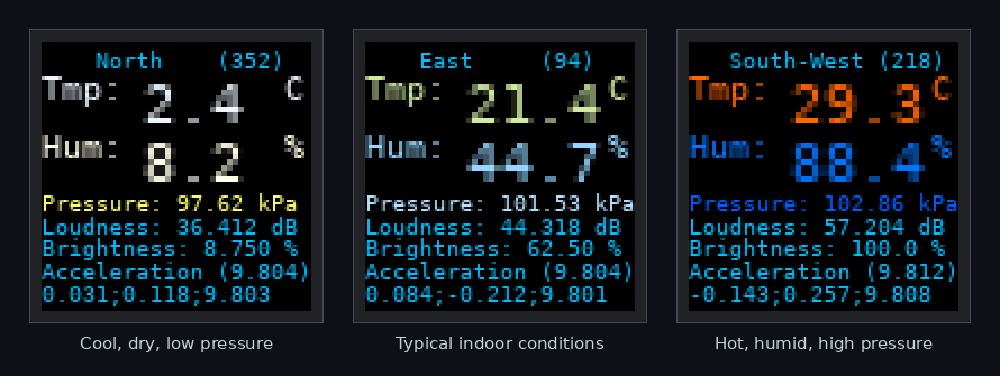
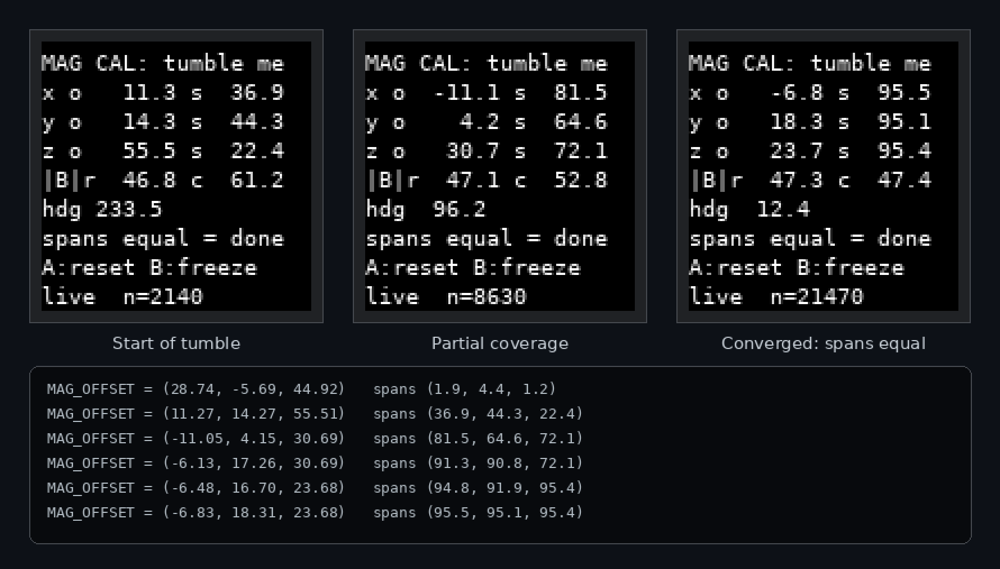

# CLUE Environmental Display

A fast CircuitPython sensor dashboard for the [Adafruit CLUE](https://www.adafruit.com/product/4500).
One 240 x 240 screen shows temperature, humidity, pressure, a tilt-compensated
true-north compass, loudness, acceleration, and the auto backlight level, with
per-quantity colour ramps.

*Screens simulated with the repository's actual layout, formats, and colour ramp code.*

## What is on screen

| Row | Source | Notes |
|---|---|---|
| Direction | LIS3MDL + LSM6DS33 | Tilt-compensated bearing of the direction you face, cardinal plus degrees |
| Tmp | SHT31-D | Colour ramp white, sky blue, yellow, red |
| Hum | SHT31-D | Colour ramp yellow, white, sky blue, purple |
| Pressure | BMP280 | Same palette as humidity, its own stops |
| Loudness | PDM microphone | dB, sound-level-meter fast time weighting (125 ms) |
| Brightness | APDS9960 | Current backlight in percent, auto from ambient light |
| Acceleration | LSM6DS33 | Filtered vector magnitude, then the x;y;z components |

## Highlights

* Fast. Labels are rewritten only when their rendered text or colour changes,
  the display refreshes manually and only when dirty, and the slow sensors are
  read round robin so no single conversion stalls the loop.
* Tilt-compensated, screen-referenced compass. The heading is the direction the
  reader faces, the same whether the board lies flat like a hand compass or
  stands upright in front of the eyes, for any `display.rotation`.
* Gamma-correct colour ramps with arbitrary RGB stops per quantity.
* Auto backlight from the light sensor, with edge-triggered button trim:
  A down, B up, A+B together returns to pure auto.
* Loudness measured the way a sound level meter does: short PDM blocks,
  energy-averaged in the power domain with the standard fast weighting.
* Every line has an explicit pixel position at the top of the file for
  one-line layout adjustments.

## Requirements

* Adafruit CLUE, CircuitPython 7.0 or newer.
* From the [Adafruit CircuitPython bundle](https://circuitpython.org/libraries),
  copied to `CIRCUITPY/lib`: `adafruit_clue`, `adafruit_apds9960`,
  `adafruit_bmp280`, `adafruit_sht31d`, `adafruit_lis3mdl`, `adafruit_lsm6ds`,
  `adafruit_display_text`, `adafruit_register`, `adafruit_bus_device`,
  `neopixel`. `ulab` is built into CLUE firmware and is used automatically
  when present.

## Install

1. Copy `code.py` and `mag_cal.py` to the CIRCUITPY drive.
2. Install the libraries above into `CIRCUITPY/lib`.
3. Calibrate the magnetometer once (below), enter the printed offsets in
   `code.py`, and the dashboard is ready.

## Magnetometer calibration

The board and its surroundings add a constant hard-iron offset that competes
with the roughly 16 uT horizontal Earth field, so the compass is meaningless
until the per-unit offsets are measured. It takes about a minute.

1. Run the tool: either connect to the serial REPL, press Ctrl-C, and type
   `import mag_cal`, or temporarily rename `mag_cal.py` to `code.py`.
2. Away from cables and metal, slowly tumble the board through every
   orientation, including steep attitudes. The `s` numbers are the span seen
   on each axis; the offsets are trustworthy when all three spans agree
   within a few uT, at roughly twice the local field.
3. Press B to freeze, copy the printed `MAG_OFFSET = (...)` line into
   `code.py`, and reload (Ctrl-D from the REPL).
4. Set `MAG_HEADING_OFFSET` to your local magnetic declination (degrees,
   east positive) if you want true rather than magnetic bearings.

Offsets are unit-specific: seed a second board with yours, then rotate it
level through one slow turn; if the heading sweeps smoothly through the
cardinals in order it is good enough, otherwise give that unit its own minute
with the tool.

## Screen-referenced heading

The compass forward axis is derived from `display.rotation`, not from the raw
sensor axes: it is the diagonal between the screen's up direction and the
direction out the back of the screen. The displayed bearing is therefore the
direction the reader faces, continuously from a flat hold to an upright one,
and it stays correct if the screen rotation is changed. If a different board
revision ever reads a constant quarter turn off, permute the single constant
`SCREEN_UP_R0` rather than touching `MAG_HEADING_OFFSET`.

## Tuning

All tunables sit in named constants at the top of `code.py`:

| Constant | Meaning |
|---|---|
| `TEMP_STOPS`, `HUM_STOPS`, `PRESS_STOPS` | Colour ramp anchor values per quantity |
| `RAMP_COLORS`, `HUM_PRESS_COLORS` | The ramp palettes, any RGB tuples, any count |
| `MAG_OFFSET`, `MAG_HEADING_OFFSET` | Hard-iron offsets and heading offset or declination |
| `LIGHT_DARK`, `LIGHT_BRIGHT` | Light-sensor counts mapped to minimum and maximum backlight; a commented debug line in the loop shows the raw counts for calibration |
| `SOUND_DB_OFFSET` | Counts-to-SPL offset, nominal 30; trim against a reference meter |
| `TEMP_OFFSET` | Board self-heating correction in deg C |
| `ACCEL_TAU`, `HEADING_TAU`, `GRAV_TAU`, `LOUD_TAU`, `BRIGHT_TAU` | Filter time constants in seconds |
| `clue_display[...].y` block | Per-line pixel positions |

## License

MIT. Based on the Adafruit CLUE example code by ladyada for Adafruit
Industries; see `LICENSE`.
